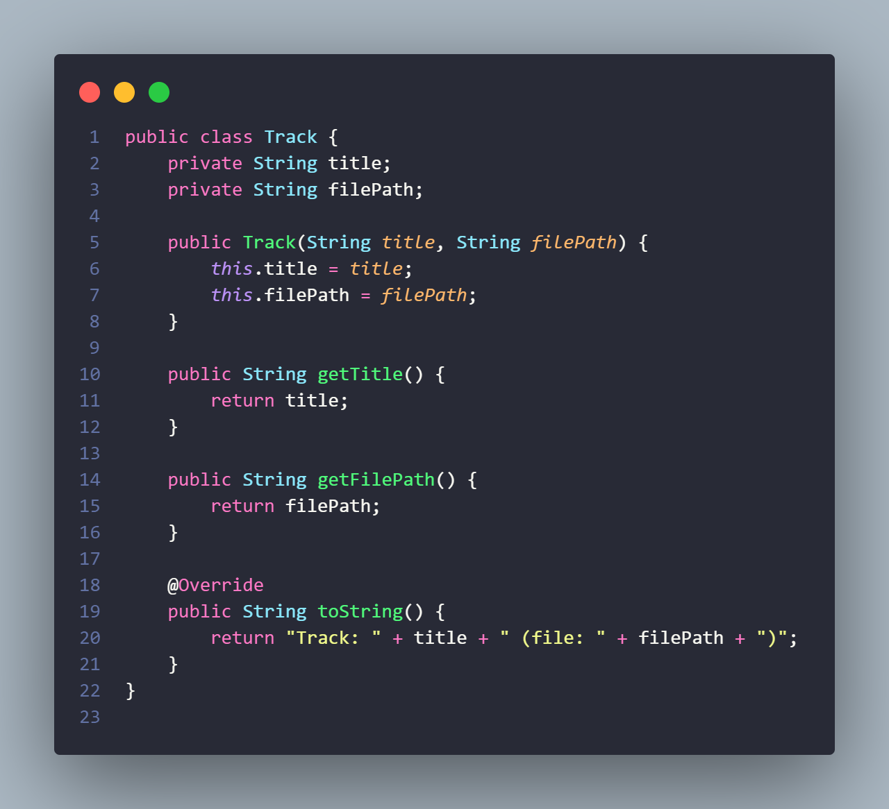
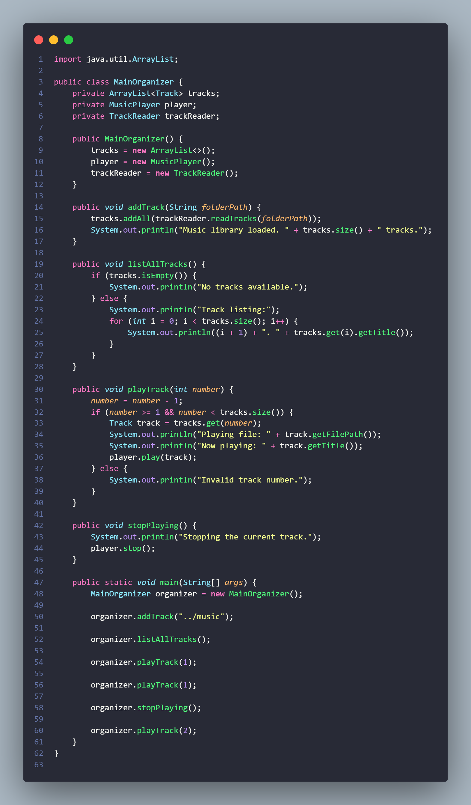

# **Studi Kasus Music Organizer**

**Nama** : Adyuta Prajahita Murdianto

**NRP** : 5025221186

**Kelas** : PBO A

## **Class Track**

### **Fungsi**

Kelas ini merepresentasikan setiap musik yang akan di kelola.

### **Atribut**

**title**

Atribut ini adalah representasi dari judul dari lagu atau `track` yang menggunakan tipe data `string`.

**filePath**

Atribut ini merupakan path ke lagu yang tersimpan pada sistem operasi, berfungsi untuk mengidentifikasi lokasi dimana lagu tersimpan.

### **Method**

**constuctor**

Berfungsi untuk mengisi value dari atribut `title` dan `filepath` sesuai input parameter saat pembuatan objek.

**getTitle**

Berfungsi sebagai `getter` dari atribut `title`, yang dimana akan mendapatkan value dari `title`.

**getFilePath**

Berfungsi sebagai `getter` dari atribut `filePath`, yang dimana akan mendapatkan value dari `filePath`.

**toString**

Berfungsi untuk mendapatkan versi string dari objek. 

## **Class TrackReader**

### **Fungsi**

Kelas ini berfungsi untuk melaksanakan tugas sebagai track reader, yaitu bertugas untuk membaca file `.mp3` dari sebuah direktori dengan bantuan ekstensi `File` bawaaan dari java dan memasukkannya ke penyimpanan lagu pada program yang berupa `ArrayList`.

### **Method**

**readTracks**

Berfungsi sebagai logika utama dalam menjalankan fungsional sebagai track reader. Kembalian dari method ini adalah sebuath `ArrayList` yang berisi lagu-lagu yang berhasil terbaca. Pertama, method akan membuat sebuah `ArrayList` baru bernama `tracks` sebagai tempat untuk menyimpan lagu. Lalu akan menginisiasi sebuah variable bernama `directory` yang dimana akan diarahkan ke `path` dari direktori letak lagu-lagu yang ingin di load. Lalu dilakukan pengecekan terhadap variabel `directory` yang dimana jika variable tersebut tidak bertipe `directory` maka akan menampilkan pesan error `Folder not found.`. Namun jika merupakan `directory` yang valid, maka setiap file yang berada didalam folder tersebut, yang dimana memiliki nama dan ekstensi `.mp3`, nama dari file tersebut akan disimpan pada variable `title` dan path dari file tersebut akan disimpan ke dalam variabel `filePath`. Lalu, kedua variabel tersebut akan digunakan untuk membuat objek `Track` baru yang merepresentasikan sebuah lagu yang sudah dibaca dan akan ditambahkan kedalam `tracks`. Lalu method akan mengembalikan `tracks` setelah selesai melakukan proses pembacaan track.

## **Class MusicPlayer**

### **Fungsi**

Fungsi kelas ini adalah menjalankan tugas sebagai music player. 

### **Atribut**

**isPlaying**

Berfungsi sebagai sarana pengecekan apakah terdapat suatu lagu yang sedang berjalan saat ini. 

### **Method**

**play**

Berfungsi untuk menjalankan track sesuai parameter input. Parameter yang diterima adalah objek dari `Track` yang ingin dijalankan. Jika saat ini sedang ada lagu yang dijalankan, maka akan mengeluarkan pesan error `A track is already playing. Stop it first.`. Namun, jika tidak ada lagu yang sedang berjalan, maka akan menjalankan lagu ditandai dengan pesan `Playing: ` diikuti oleh nama lagunya dengan memamnggil method `getNme` dari `track`. Setelah itu akan mengupdate nilai `isPlaying` menjadi `true` untuk memberi tahu sistem bahwa saat ini sedang ada lagu yang dijalankan.

**stop**

Berfungsi untuk memberhentikan lagu yang saat ini sedang berjalan. Pertama dilakukan pengecekan apakah terdapat lagu yang sedang berjalan, jika ada maka akan memberhentikan lagu yang ditandai pesan `Music stopped.` serta mengganti value `isPlaying` menjadi `false`. JIka tidak ada lagu yang sedang berjalan, maka akan mengeluarkan pesan error `No track is currently playing.`.

## **Class MainOrganizer**

### **Fungsi**

### **Atribut**

### **Method**

